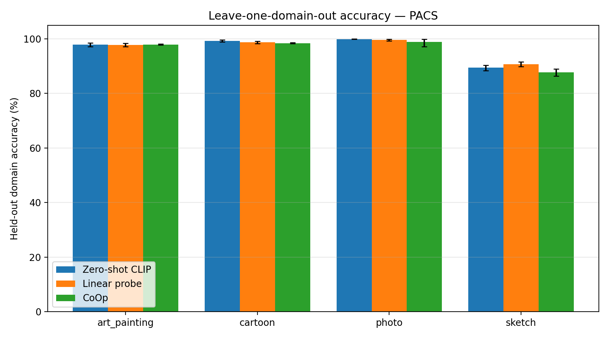
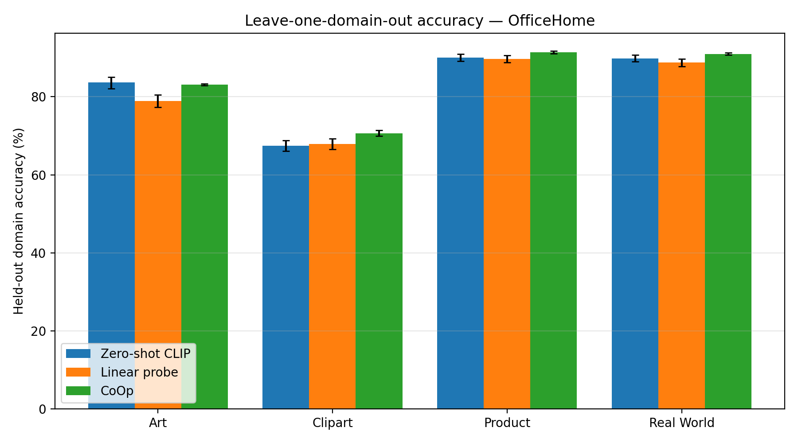

# Do Learned Prompts Generalize? Auditing CLIP Prompt Learning under Domain Shift

Prompt learning (CoOp) adapts CLIP to a downstream task by training a few thousand
parameters instead of fine-tuning the backbone — but prompts learned on one visual
domain are known to overfit its style. This project audits that failure mode with a
controlled comparison of **zero-shot CLIP**, **prompt ensembles**, **linear probing**,
and **CoOp** under leave-one-domain-out evaluation on **PACS** and **OfficeHome**,
asking not just *how much* accuracy drops under domain shift, but *where* (per-domain
and per-class slices) and *why* (interpretation of the learned context vectors).

Motivated by work on generalizable prompt learning: CoOp/CoCoOp (Zhou et al.),
Style-Pro (WACV 2025), and DiSa (SIGKDD 2025).

## Methods compared

| Method | Trainable params | What it isolates |
|---|---|---|
| Zero-shot CLIP (single template) | 0 | Pretrained representation alone |
| Zero-shot + prompt ensemble | 0 | Effect of hand-written style-diverse prompts |
| Linear probe | ~0.3K–33K | Supervised head on frozen features |
| CoOp (16 context vectors) | ~8K | Learned continuous prompts |

## Protocol

- **Leave-one-domain-out (LODO):** train on all source domains, evaluate on the held-out
  target domain. Model selection uses a validation split of the *source* domains only —
  the target domain is never touched before final evaluation.
- **3 seeds** per (method, target-domain) cell for trained methods.
- **1000-resample bootstrap 95% CIs** on per-example correctness.
- **Slice analysis:** per-domain and per-class accuracy, to show what aggregate numbers hide.
- **Prompt interpretation:** nearest vocabulary tokens to each learned context vector.

## Setup

```bash
pip install -r requirements.txt
python scripts/smoke_test.py   # verifies CLIP + CoOp implementation end-to-end
```

### Data

Place datasets under `data/` as `data/<DATASET>/<domain>/<class>/<images>`:

```
data/PACS/art_painting/dog/*.jpg        # 4 domains, 7 classes, ~10k images
data/OfficeHome/Art/Alarm_Clock/*.jpg   # 4 domains, 65 classes, ~15.5k images
```

- **PACS:** download via [DomainBed](https://github.com/facebookresearch/DomainBed) or a
  Kaggle mirror (search "PACS domain generalization").
- **OfficeHome:** download from the [official page](https://www.hemanthdv.org/officeHomeDataset.html).

Domain/class folders are discovered automatically. Verify with:

```bash
python scripts/check_setup.py --data_root data/PACS
```

## Run

```bash
python scripts/eval_baselines.py --config configs/pacs.yaml        # zero-shot + linear probe
python scripts/train_coop.py     --config configs/pacs.yaml        # CoOp, all folds x seeds (resumable)
python scripts/aggregate_results.py --results_dir results/PACS     # markdown results table
python scripts/plot_results.py      --results_dir results/PACS     # per-domain chart
python scripts/interpret_prompts.py --results_dir results/PACS     # nearest tokens of learned prompts
```

Same commands with `configs/officehome.yaml` for OfficeHome. All experiments run on a
single 6GB consumer GPU (CLIP backbone frozen throughout; only context vectors train).

## Results

Held-out domain accuracy (%), CLIP ViT-B/16. CoOp is mean±std over 3 seeds; feature
caching verified equivalent to uncached training before any full runs.

**PACS**

| Method | art_painting | cartoon | photo | sketch | Mean |
|---|---|---|---|---|---|
| Zero-shot (ensemble) | 97.9 | 99.3 | 99.9 | 89.4 | 96.6 |
| Linear probe | 97.8 | 98.7 | 99.6 | 90.7 | 96.7 |
| CoOp | 97.9±0.1 | 98.4±0.2 | 98.9±1.2 | **87.8±1.1** | 95.8 |

**OfficeHome**

| Method | Art | Clipart | Product | Real World | Mean |
|---|---|---|---|---|---|
| Zero-shot (ensemble) | 83.6 | 67.5 | 90.0 | 89.9 | 82.8 |
| Linear probe | 78.9 | 67.9 | 89.7 | 88.8 | 81.3 |
| CoOp | 83.1±0.2 | **70.7±0.6** | **91.5±0.3** | **90.9±0.2** | **84.0** |




Sanity anchor: our zero-shot means (96.6 PACS, 82.8 OfficeHome) match published
CLIP ViT-B/16 numbers, validating the pipeline before trusting the new results.

## Analysis

**The two benchmarks land on opposite sides of a trade-off, and that contrast is
the finding.**

- **PACS: CoOp loses to zero-shot** (95.8 vs 96.6 mean), despite training on ~7k
  labeled source images. PACS's shifts are extreme style changes and zero-shot is
  near ceiling: learned prompts have little to gain in class discrimination and pay
  a style-overfitting cost — largest exactly on the largest shift (sketch, −1.6).
  CoOp also shows seed instability that averages hide (photo: 97.2/99.6/99.8).
- **OfficeHome: CoOp wins** (84.0 vs 82.8 mean; Clipart +3.2). Shifts are milder,
  but 65 fine-grained classes leave zero-shot far from ceiling — sharper learned
  class boundaries outweigh the style cost.
- **Linear probing is the most brittle** adapter under style shift (OfficeHome Art:
  78.9 vs 83.6 zero-shot): a task-specific head departs further from CLIP's semantic
  structure than prompt-space adaptation does.

Summary: **prompt learning helps when the bottleneck is class discrimination and
hurts when the bottleneck is style generalization.** This is the landscape that
generalizable prompt-learning methods (CoCoOp, Style-Pro, DiSa) are designed for:
keep the discrimination gains, remove the style-overfitting cost.

**Prompt interpretability (null result).** Decoding learned context vectors to
their nearest vocabulary tokens yields no interpretable words (random fragments,
consistent across seeds) — replicating the observation in the original CoOp paper
that learned prompts lie off the token-embedding manifold. The style-overfitting
evidence above is therefore behavioral (per-domain slices), not token-level; a
sharper probe (e.g., a domain classifier trained on context vectors, or CKA between
text features under learned vs. hand-written prompts) is future work.

## Limitations & future work

- Single backbone (ViT-B/16); no CoCoOp/style-aware baselines yet (compute-bounded).
- No augmentation during prompt training (deterministic features enable exact
  caching; all trained methods see identical inputs, so comparisons are internally
  consistent).
- Natural next steps: CoCoOp and Style-Pro-style regularization, corruption shift
  as a second axis, and test-time prompt adaptation on unlabeled target data.

## References

- Radford et al., *Learning Transferable Visual Models From Natural Language Supervision* (CLIP), ICML 2021
- Zhou et al., *Learning to Prompt for Vision-Language Models* (CoOp), IJCV 2022
- Zhou et al., *Conditional Prompt Learning for Vision-Language Models* (CoCoOp), CVPR 2022
- Talemi et al., *Style-Pro: Style-Guided Prompt Learning for Generalizable Vision-Language Models*, WACV 2025
- Talemi et al., *DiSa: Directional Saliency-Aware Prompt Learning for Generalizable Vision-Language Models*, SIGKDD 2025
- Li et al., *Deeper, Broader and Artier Domain Generalization* (PACS), ICCV 2017
- Venkateswara et al., *Deep Hashing Network for Unsupervised Domain Adaptation* (OfficeHome), CVPR 2017
